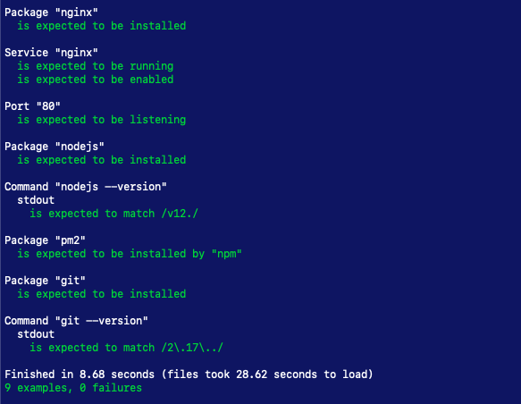
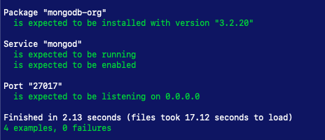
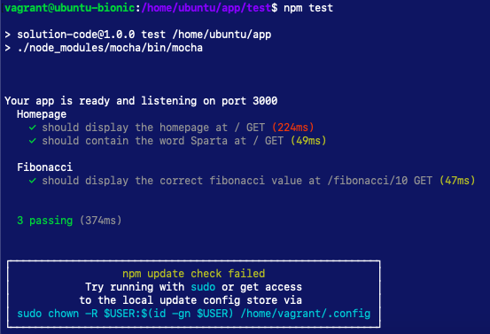

# Sparta Node Sample App with CI

## Introduction
This documents the process of creating a CI pipeline for a Sparta sample node app.

## Pre-Requisites
1. Vagrant
2. Ruby
3. Bundler
4. Virtual Box
5. Git
6. Jenkins

## Instructions
1. Clone this repo
2. Run `vagrant up`
3. Go to `development.local` or `192.168.10.100`

### Running local tests
1. Run `vagrant up app` and `vagrant up db`
2. In a separate terminal window, navigate to the tests directory `cd tests/`
3. Run `rake spec`       
  

4. Vagrant ssh into the App
5. Navigate to the app directory `cd /home/ubuntu/app`
6. Stop the app from running as this will prevent the tests from passing. `pm2 stop app.js`
6. Run `npm test`    
  

### CI
1. Navigate to Jenkins
2. Login, create a user if necessary
3. Create a 'new item' and click 'Freestyle Project'.
4. Proceed to configure the file.

## Testing merges
Test 1 - Configured file
Test 2 - Small change to test to check if failures are not merged 
